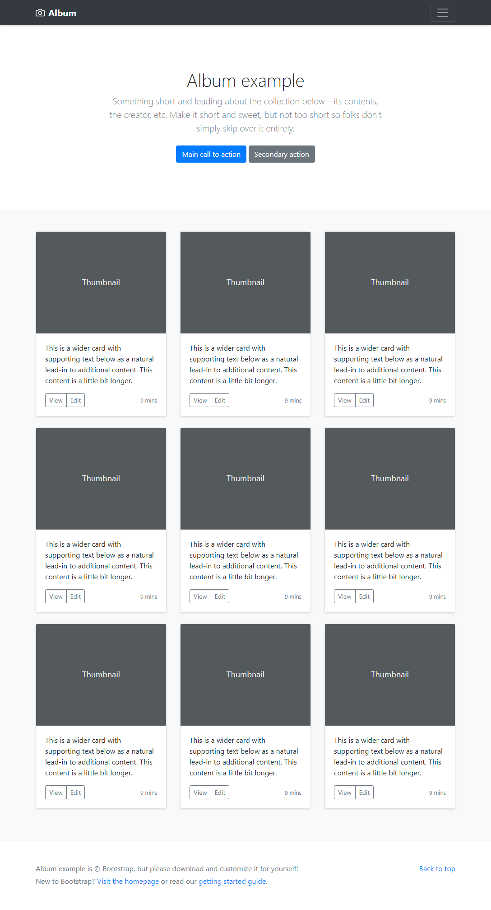

# Homework - Layout

Replicate the following design taken from the Bootstrap examples page in pure HTML and CSS. Use all the knowledge you have up to this point.

Also have a contact page where the form looks like in the below example (textarea to the right of the fields). Link to the contact page the `Main call to action` button above.

Once finished, add, commit and push your work.

## Extra miles (might give you bonus points):

1. Social media links on the contact page should have apropriate icons (use font-awesome as described below).
2. The contact page should have the same header and footer as the main page.

## Notes:

1. Making the hamburger menu (3 horizontal lines button) functional is not part of the requirement, **just create the button and make it look ok.**
2. For icons (hamburger (3 horizontal lines button) and photo camera) use an icon font. Try **Font Awesome** for example (google it to find how it works and how to use it)
3. For images inside the cards use [Picsum](https://picsum.photos/)
4. Responsivity or mobile development is not required at this stage
5. Don't use Bootstrap or any other lib or framework.
6. Use all the rules we've learned, some reminders:
   1. index.html should be the name of the main file
   2. Use semantic elements in the HTML code, avoid divs and spans unless there is no other more apropriate tag.
   3. CSS should be external in a styles folder, not inline or embedded
   4. Use classes over ids and element selectors, try to start selectors from classes not elements unless you have an element with class (li.menu-item)
   5. You can use the \* selector to set box-sizing but not more
   6. Don't have more than 2 selector combinators in a single selector (shallow selectors)
   7. Don't use !important
   8. Try to logically group your properties inside styling declarations
